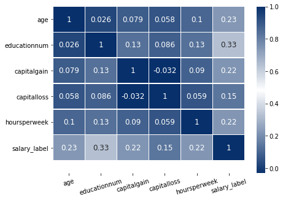
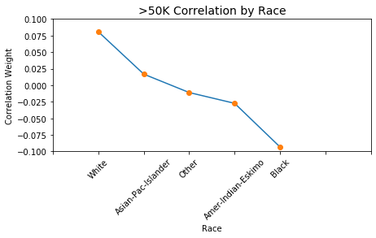
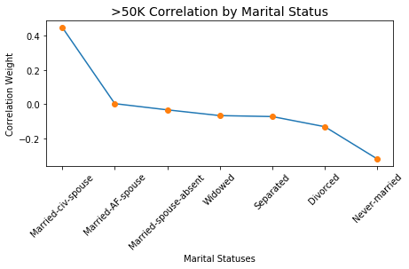
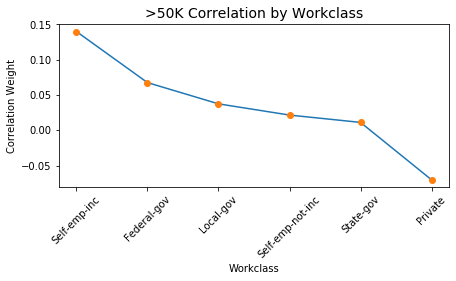
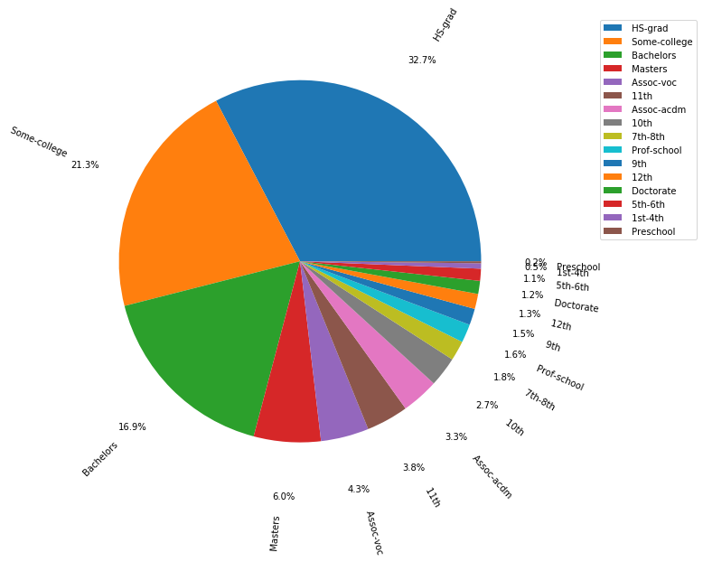
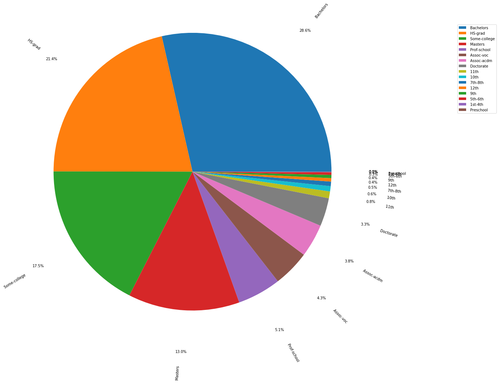
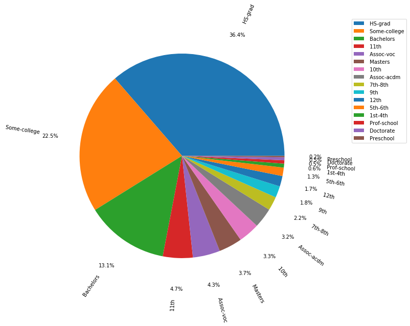
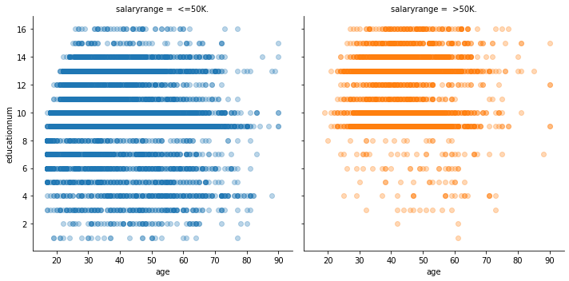
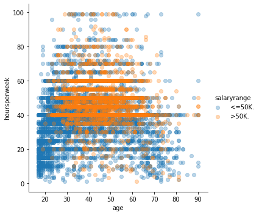
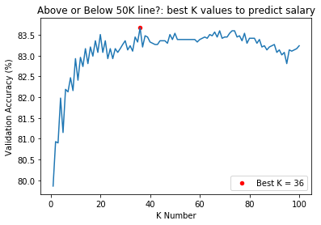

# Census-Data: Predicting Salary Range

## Motivation 
The goal of this supervised machine learning algorithm is to decide which socioeconomic factors will reliably predict whether an individual makes less than or more than $50,000 yearly. The dataset being used is found on UCI’s machine learning repository and was collected in 1994.

For context, $50,000 in 1994 is the rough equivalent of $87,000 in 2020. Calculations made on this 
<a href="https://www.in2013dollars.com/us/inflation/1994?amount=50000">website</a>.

# Table of contents
1. [What to Expect](#expect)
2. [Code Style](#codestyle)
3. [Package Manager](#package)
4. [IDE](#ide)
5. [Dataset Download](#dataset)
6. [Feature Engineering](#feature)
7. [Preprocessing Visualization](#preprocessing)
         - [Correlations](#corr)
         - [Education and Age Distribution](#eduage)
         - [Hours/week Distribution](#hrs)
8. [Algorithms and Results](#algorithms)
9. [Troubleshooting](#troubleshooting)
10. [License](#license)

## What to Expect 
I have compiled each phase of building the algorithm, from preprocessing to analysis, into this one file:

 <ul style="list-style-type:disc">
 <li><b>Step 1:</b> Data introduction</li>
         <li><b>Step 2:</b> Data clean-up</li>
         <li><b>Step 3:</b> Creating dataframes by varying features</li>
         <li><b>Step 4:</b> Exploring data visually</li>
         <li><b>Step 5:</b> Training labeled data on K Nearest Classifier</li>
         <li><b>Step 6:</b> Training labeled data on Decision Forest Classifier</li>
         <li><b>Step 7:</b> Training labeled data on Logistic Regression Classifier</li>
      </ul>
      
## Code Style 
<a href="https://docs.python.org/3.7/contents.html">Python version 3.7.4.</a>

## Package manager 
<a href="https://repo.anaconda.com/">Anaconda</a> with the following <a href="https://www.youtube.com/watch?v=5mDYijMfSzs&t=255s">download tutorial.</a>

## IDE 
<a href="https://jupyter.org/about">Jupyter Notebook</a>, which is downloaded when Anaconda is downloaded.

## Dataset Download 
<a href="https://archive.ics.uci.edu/ml/datasets/census+income">UCI Machine Learning Repository</a>

## Feature Engineering 
<ul style="list-style-type:disc">
         <li>Age</li>
         <li>Workclass</li>
         <li>Education</li>
         <li>Education Number (numerical ranking of education)
         </li>
         <li>Marital Status</li>
         <li>Occupation</li>
         <li>Relationship</li>
         <li>Race</li>
         <li>Sex</li>
         <li>Capital Gain</li>
         <li>Capital Loss</li>
         <li>Country of Origin</li>
         <li>Salary Label</li>
      </ul>

## Preprocessing Visualization 

### Correlations 
From the initial correlation heatmap below, we understand that "educationnum" has the highest correlation with the salary label amongst the given features. We should be mindful that the absolute value of this correlation (.33) isn't so convincing that we'll find a strong correlation. For now, we should rely on "educationnum" as the guiding feature for our initial visualization. 

From here, we took a closer look at how correlation varies within a description. For example, if two individuals overlap in major factors (i.e. education, workclass, and hours per week are the same), could there still be a discrepancy if one person is a spouse, while the other lives alone. I broke it down by race, marital status, workclass, and relationship below.

### Education and Age Distribution 

With these next two pie graphs, we can better understand the relative distribution of education level contributing to the overall database.

Since we'll be using the salary range as our label, we have to split up our knowledge based on who makes above 50k (our '1' label) and who makes below 50k ('0' label). To better understand how education level can effect salary prediction, I created the next two pie charts: (1) education level of people who make ABOVE 50k, (2) education level of people who make BELOW 50K salary. At first glance, we see that those who fall in the "bachelor's", "high school grads", and "some college" dominate the pool of the census that make above 50K.

The following scatterplot reveals that a general cutoff of education level to make above 50K is those who pass the 12th grade (or "8" as seen on the graph's y-axis). Breakdown of the education level from quantitative to qualitiative is also as follows: 1 - preschool, 2 - 1st-4th, 3 - 5th-6th, 4 - 7th-8th, 5 - 9th, 6 - 10th, 7 - 11th, 8 - 12th, 9 - HS grad, 10 - Some-college, 11 - Associates-vocational, 12 - Assoc-academic, 13 - Bachelors, 14 - Masters, 15 - Professional school, 16 - Doctorate. 

The initial correlation heatmap reveals that age is the next strongest feature, after education level, to predict salary label. As expected, younger kids who are in their teens are likely to make less than 50K. Could be due to education level, or the amount of hours they're legally allowed to commit to.

### Hours/Week Distributions  

The next logical step was to combine how both age and hours per week worked can predict the salary label. It's interesting to see how a person can work an upwards of 60+ hours per week and not make it to the >50k yearly salary. In the other group, it looks like the horus are clustered between 35 and 65 hours per week. This could indicate that we eventually need a closer look into the occuption sector for each group.

## Algorithms and Results 
<ol>
    <li><a href="https://en.wikipedia.org/wiki/K-nearest_neighbors_algorithm">K Nearest Classifier</a>
        <ul>
             <li> We found that 13 was the best K for our dataset to use for the K Nearest Neighbors Algorithm.
              
             </li>
         <li> Train score = 84.07%
          <li> Test score = 83.51%
         </li>
        </ul>
    </li>
    <li><a href="https://en.wikipedia.org/wiki/Random_forest">Decision Forest Classifier</a>
        <ul> 
         <li> Train score = 98.71% 
          <li> Test score = 84.03%
         </li>
        </ul>
    </li>
    <li><a href="https://en.wikipedia.org/wiki/Logistic_regression">Logistic Regression Classifier</a>
        <ul>
         <li> Train score = 85.41%
          <li> Test score = 85.14%
         </li>
        </ul>
     </li>
</ol>

## Troubleshooting 

For the future:
<ul style="list-style-type:disc">
 <li> I would like to use the same training algorithm and run it across varying cities using the 2020 census. I'd be curious to see how feature weights could vary across major cities, and eventually see whether there's variance between the 1994 and 2020 census. I'd also want to change the question of how much a household makes, to intead explore how the US Census affects local funding (i.e. any differences in school funding from block-to-block.)
 </li>
 </ul>

## License 
MIT
      
